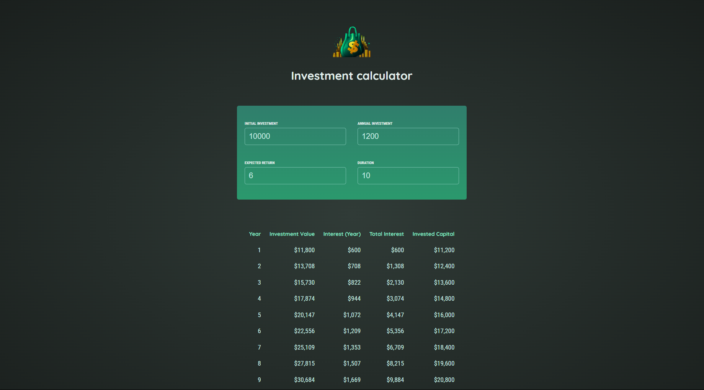

# Investment-Calculator-App


## Overview

The Investment Calculator App is a demo web application that helps users calculate the future value of their investments based on inputs such as the initial investment amount, interest rate, and duration. This project is built using React and Vite for a fast and efficient development experience.

## Features

- Input fields for initial investment, annual Investment, interest rate, and duration.
- Dynamic calculation of investment growth.
- User-friendly interface.
- Real-time updates of calculation results.

## Demo



## Installation

1. **Clone the repository:**

   ```sh
   git clone https://github.com/snehagupta20/Investment-Calculator-App.git
   cd Investment-Calculator-App
   ```

2. **Install the dependencies:**

   ```sh
   npm install
   ```

3. **Start the development server:**

   ```sh
   npm run dev
   ```

4. **Open the app in your browser:**

   Go to `http://localhost:3000` or the URL specified by Vite.

## Usage

1. **Enter the initial investment amount.**
2. **Enter the annual interest rate (in percentage).**
3. **Enter the investment duration (in years).**
4. **The app will automatically calculate and display the future value of your investment.**

## Project Structure

```plaintext
Investment-Calculator-App/
├── node_modules/
├── public/
├── src/
│   ├── components/
│   │   ├── Header.jsx
│   │   ├── InvestmentForm.jsx
│   │   ├── ResultDisplay.jsx
│   │   └── ...
│   ├── App.jsx
│   ├── index.css
│   ├── main.jsx
│   └── ...
├── .gitignore
├── index.html
├── package-lock.json
├── package.json
├── README.md
└── vite.config.js
```

## Components

- **Header.jsx**: Displays the header with the app logo and title.
- **InvestmentForm.jsx**: Form component for user input (initial investment, interest rate, duration).
- **ResultDisplay.jsx**: Displays the calculated future value of the investment.

## Contributing

1. **Fork the repository.**
2. **Create a new branch (`git checkout -b feature-branch`).**
3. **Make your changes and commit them (`git commit -m 'Add new feature'`).**
4. **Push to the branch (`git push origin feature-branch`).**
5. **Create a pull request.**

## Contact

- **Name**: Sneha Gupta
- **Email**: gsneha20012004@gmail.com